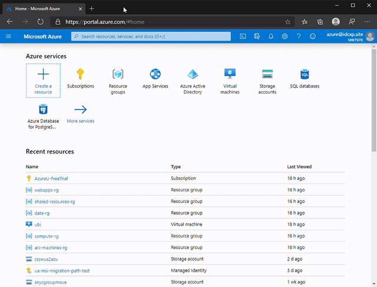

# Directory change for Azure Subscription
## Who must read this document
Any organization or individual who is managing Azure environments and potentially have the need to change their directory tenant.

## Background
Directory change for an Azure Subscription ([official documentation](https://docs.microsoft.com/en-us/azure/active-directory/fundamentals/active-directory-how-subscriptions-associated-directory)) may be very complex task and must be executed with caution.
This project focuses on analysing deployed Azure resources that are known to depend on the home tenant of your Azure Subscription. 
Because resource types in Azure are constantly evolving and new are added on a fast pace, the project cannot catch all and everything.
However we are doing our best to update content based on real customer experiences.


## Project structure
In order to simplify requirements, this project is inteted to be run in a cloud shell in the context of a user 
who has permissions to change directory for the subsription.
This has a lot of benefits - all prerequisits are already installed and the user is signed-in.

The project is structed as follows
```
 + project root
 |--apply-rbac.py
 |--check-aad-deps.sh
 |--dump-rbac.py
 |--readme.md
 |--run.sh
 |--subscription-dir-change.zip
```

There are three main files - [apply-rbac.py](./apply-rbac.py), [check-aad-deps.sh](./check-aad-deps.sh) and [dump-rbac.py](./dump-rbac.py). 
They are compressed into [subscription-dir-change.zip](./subscription-dir-change.zip). 
Finally we have a bootstrapper shell script [run.sh](./run.sh).

All that `run.sh` does, is to download the compressed package, uncompress it to a new folder within `~/clouddrive` in your cloud shell and finally
call the `check-aad-deps.sh`. This enables the execution of the script to be just a single liner in Cloud Shell:

```
  curl -L https://raw.githubusercontent.com/Dayzure/subscription-directory-change/master/run.sh | bash
```

Just to be even shorter, I added the RAW URL to a short link:
```
  curl -L https://aka.ms/as/dirchange | bash
```

## Generating report and saving current RBAC assignment

In order to scrape all your RBAC assignments (and neccessary data about user and system assigned MSIs), just run the following command within a cloud shell (BASH):
```
  curl -L https://aka.ms/as/dirchange | bash
```

That will crawl the current active context. If you are using multiple subscriptions, be sure to first set the active context to the subscirption you want to scrape.
You can achieve that by running the following command within Cloud Shell (BASH):

```
  az account set --subscription <name or id of the subscription>
```

### Quick scraping process view




### Behind the scenes

The file `check-aad-deps.sh` runs and report on the following:

 * Resources with known Azure AD Tenant dependencies
 * Azure SQL Databases with configured Azure AD Authentication
 * Current RBAC assignments
 * Generates an HTML based report for the resources and gives a relative link for download ([you can download files from Cloud Shell](https://docs.microsoft.com/en-us/azure/cloud-shell/using-the-shell-window#upload-and-download-files))
 * Calls `dump-rbac.py` to save neccessary data

 ### Saving current RBAC data
 Current RBAC data is saved by the `dump-rbac.py` file. The file does the following:

  * Lists and saves all custom RBAC roles
  * Lists and saves all RBAC assignments as:
    * User objects are saved using e-mail address
    * MSI are saved with indication user-assigned or system-assigned MSI
    * Service Principals are not preserved
    * Groups are not preserved

> !Important: In order to function correctly, the user running the script must be able to read all users and all service principals in current directory. 
> By default all users can enumerate user and service principal objects. But in certain situations and Azure AD settings, it may be that your user
> cannot read other objects. If this is the case, work out with the administrator of Azure AD tenant.

## Restoring RBAC permissions
After you have preserved the RBAC state and you changed the directory for subscription, it is time to restore RBAC assignments.
Sign-in again to cloud shell and navigate to the following folder:

```
 cd ~/clouddrive/dirchange-{subscription-id}
```

This folder has been created by the first run of the script.
Run the `apply-rbac.py` by executing the following command:

```
 ./apply-rbax.py
```

The script will:

* Recreate all custom RBAC roles at their respective places (subscription or resource group)
* Wait 20 seconds to make sure data is replicated
* Load saved RBACs and recreate them:
    * For User objects it will look based on the saved e-mail attriube. First looking at `upn`, then in `mail` property.
    * For user assigned managed identities, it will create the user assigned MSI in the new tenant in the same resource group and assign respective role.
    * For system assigned managed identiies, it will update the resource that have system assigned MSI and will assign respective role 

### Quick apply process view


